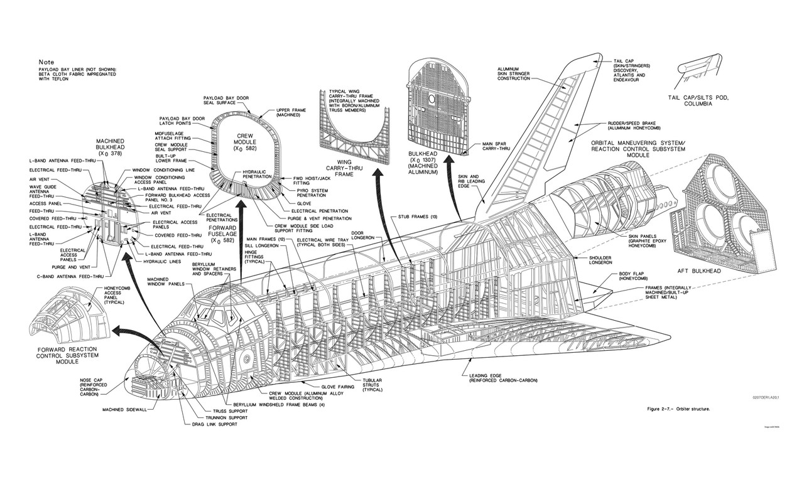

<details>
    <summary>NASA Space Shuttle</summary>



</details>

<table>
    <tr>
        <td><span class="red">A</span></td>
        <td><span class="yellow">B</span></td>
        <td><span class="green">C</span></td>
    </tr>
    <tr>
        <td colspan="3" style="text-align: center;"><span class="blue">D</span></td>
    </tr>
    <tr>
        <td><span class="yellow">E</span></td>
        <td><span class="red">F</span></td>
        <td><span class="yellow">G</span></td>
    </tr>
</table>

```js
const longText = "Lorem ipsum dolor sit amet, consectetur adipiscing elit. Suspendisse egestas mauris augue, eu rutrum arcu \nviverra in. Orci varius natoque penatibus et magnis dis parturient montes, nascetur ridiculus mus. \nDuis consectetur velit ac lacus convallis auctor nec ut leo. Phasellus urna sem, rhoncus et convallis \nvel, vestibulum a felis. Etiam metus massa, hendrerit vitae rutrum non, rutrum quis magna. Nunc arcu \ndui, lobortis nec nunc vitae, elementum sollicitudin nulla. Praesent non enim eu odio sagittis ultricies \nat tempor nisi. Nunc id ipsum non nibh convallis sagittis rhoncus et tellus. Duis iaculis convallis \nlectus, at feugiat enim pretium ac. Ut posuere malesuada lorem quis lobortis".split(" ")
```

```js
const n = view(Inputs.range([0, longText.length], {step: 1}));
```
```js
display(longText.slice(1,n).join(" "));
```

## Gapminder
```js
const gapminder = FileAttachment("./data/gapminder.zip").zip();
```

```js
const gapminderFiles = gapminder.filenames;
display(gapminderFiles);
```

```js
const continentsFilename = gapminderFiles.find((name) => /continents/i.test(name));
const continents = await gapminder.file(continentsFilename).csv();
```

```js
display(Inputs.table(continents));
```

```js
const countryList = document.createElement("ul");
for (const row of continents) {
    const item = document.createElement("li");
    item.textContent = row.Entity;
    countryList.appendChild(item);
}
display(countryList);
```

## Life expectancy (2010)

```js
const lifeExpectancy2010 = await FileAttachment("./data/life-expectancy.csv").csv();
```

```js
display(Inputs.table(lifeExpectancy2010));
```

## GDP (2010)

```js
const gdp2010 = await FileAttachment("./data/gdp-2010.csv").csv();
```

```js
display(Inputs.table(gdp2010));
```

## GDP vs life expectancy (2010)

```js
const dotColor = view(
    Inputs.radio(["red", "green", "blue"], {
        label: "Dot color",
        value: "red"
    })
);
```

```js
import * as Plot from "npm:@observablehq/plot";
import {extent} from "npm:d3-array";
import {format} from "npm:d3-format";

const lifeKey = Object.keys(lifeExpectancy2010[0]).find((k) => /life expectancy/i.test(k));
const gdpKey = Object.keys(gdp2010[0]).find((k) => /gdp/i.test(k));

const gdpByEntity = new Map(gdp2010.map((d) => [d.Entity, +d[gdpKey]]));

const scatterData = lifeExpectancy2010
    .map((d) => ({
        Entity: d.Entity,
        life: +d[lifeKey],
        gdp: gdpByEntity.get(d.Entity)
    }))
    .filter((d) => Number.isFinite(d.life) && Number.isFinite(d.gdp) && d.gdp > 0);

const lifeDomain = extent(scatterData, (d) => d.life);
const gdpDomain = extent(scatterData, (d) => d.gdp);

const formatGdpTick = (d) => {
    if (d >= 1000) return `$${format(",.0f")(d / 1000)}k`;
    return `$${format(",.0f")(d)}`;
};

display(
    Plot.plot({
        width: 760,
        height: 460,
        marginLeft: 56,
        marginBottom: 52,
        grid: true,
        x: {
            type: "log",
            domain: gdpDomain,
            label: "GDP per capita (USD, log scale)",
            tickFormat: formatGdpTick
        },
        y: {
            type: "linear",
            domain: lifeDomain,
            label: "Life expectancy (years)",
            tickFormat: (d) => format(".0f")(d)
        },
        marks: [
            Plot.dot(scatterData, {
                x: "gdp",
                y: "life",
                title: "Entity",
                r: 3.5,
                fill: dotColor,
                fillOpacity: 0.6,
                stroke: dotColor,
                strokeOpacity: 0.9
            })
        ]
    })
);
```